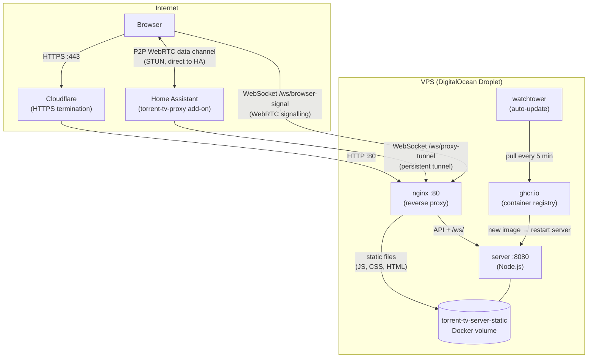

# torrent-tv infra

Docker Compose infrastructure for running the `torrent-online` server on a VPS. Includes nginx as a reverse proxy, Watchtower for automatic image updates, and optional local-build mode for development.

## Stack

| Service | Image | Role |
|---------|-------|------|
| `server` | `ghcr.io/torrent-tv/server:latest` | Node.js app — proxy registry + WebRTC signalling + frontend |
| `nginx` | `nginx:alpine` | Reverse proxy on port 80; serves static files directly |
| `watchtower` | `containrrr/watchtower` | Polls GHCR every 5 min and pulls updated images automatically |

HTTPS termination is handled by **Cloudflare** (orange cloud proxy) — no Let's Encrypt or Certbot needed on the droplet.

## Architecture



## Request Flow

```mermaid
sequenceDiagram
  participant B as Browser
  participant CF as Cloudflare
  participant NX as nginx :80
  participant SV as server :8080
  participant HA as HA Proxy add-on

  Note over B,HA: Static assets
  B->>CF: GET /app.js
  CF->>NX: HTTP GET
  NX->>NX: try_files → volume
  NX-->>B: file from volume (nginx, no Node hit)

  Note over B,HA: API request
  B->>CF: GET /api/proxy-clients/health
  CF->>NX: HTTP GET
  NX->>SV: proxy_pass @node
  SV->>HA: health-request via tunnel WS
  HA-->>SV: health-response
  SV-->>B: JSON

  Note over B,HA: WebRTC signalling
  B->>CF: WebSocket /ws/browser-signal
  CF->>NX: Upgrade: websocket
  NX->>SV: proxy_pass /ws/ (upgrade headers set)
  SV-->>B: { type: "session", sessionId }
  B->>SV: SDP offer → forwarded to HA via tunnel
  HA->>SV: SDP answer → forwarded to B via /ws/

  Note over B,HA: P2P streaming (bypasses server entirely)
  B<-->HA: WebRTC data channel
```

## Directory Layout

```
infra/
├── docker-compose.yml           # base: server + nginx + shared volume
├── docker-compose.prod.yml      # prod overlay: watchtower
├── docker-compose.local.yml     # dev overlay: build server from ../server source
├── prod.sh                      # convenience script: up -d with prod overlay
└── nginx/
    ├── webauth.courses.conf     # server block for the production domain
    └── compression.common       # shared gzip settings (included by server blocks)
```

## Server Layout on the Droplet

Both repos need to sit side-by-side so the local-build context works:

```
/srv/torrent-tv/
├── infra/     ← this repo
└── server/    ← torrent-tv/server repo
```

## Deploy

### First time

```bash
ssh root@<droplet-ip>
mkdir -p /srv/torrent-tv && cd /srv/torrent-tv
git clone git@github.com-personal:torrent-tv/infra.git
git clone git@github.com-personal:torrent-tv/server.git
cd infra
docker compose -f docker-compose.yml -f docker-compose.prod.yml up -d
```

After first deploy, Watchtower takes over: it polls GHCR every 5 minutes and automatically restarts the `server` container when a new image is pushed.

### Manual update (if you don't want to wait for Watchtower)

```bash
cd /srv/torrent-tv/infra && git pull
docker compose -f docker-compose.yml -f docker-compose.prod.yml pull
docker compose -f docker-compose.yml -f docker-compose.prod.yml up -d
```

### Deploy via prod.sh

```bash
cd /srv/torrent-tv/infra
./prod.sh    # equivalent to: docker compose -f … -f … up -d --build
```

## Local Development

Build the server image from source instead of pulling from GHCR:

```bash
cd infra
docker compose -f docker-compose.yml -f docker-compose.local.yml up --build
```

nginx is available at `http://localhost:80`. The `docker-compose.local.yml` overlay overrides the server's `image:` with a `build: context: ../server` so docker compose builds from your local changes.

## nginx Configuration

### Static files via Docker volume

The `server` container populates the `torrent-tv-server-static` volume with compiled frontend assets. nginx mounts the same volume read-only and serves files from it directly — the Node.js process is never hit for static assets.

```
Browser → nginx → Docker volume → response   (fast, no Node.js hop)
Browser → nginx → Node.js       → response   (fallback for /api, /health, /ws)
```

### WebSocket proxying

The `/ws/` location block sets the correct upgrade headers (`Upgrade`, `Connection`) and uses a 3600 s `proxy_read_timeout` so long-lived WebSocket connections — the proxy tunnel and browser signalling — don't get killed by nginx's idle timeout.

```nginx
location /ws/ {
    proxy_pass $upstream;
    proxy_http_version 1.1;
    proxy_set_header Upgrade $http_upgrade;
    proxy_set_header Connection "upgrade";
    proxy_read_timeout 3600s;
}
```

### Dynamic upstream resolution

nginx uses `resolver 127.0.0.11` (Docker's internal DNS) with `valid=10s` so it re-resolves the `server` hostname after Watchtower restarts the container. Without this, nginx caches the old IP and returns 502 until it's reloaded.

```nginx
resolver 127.0.0.11 valid=10s;
set $upstream http://server:8080;
```

### Adding a new service

1. Add the service to `docker-compose.yml`.
2. Create `nginx/<your-domain>.conf` — copy `webauth.courses.conf` as a template and change `server_name`, `root`, and `set $upstream`.
3. Add a DNS A record in Cloudflare pointing to the droplet IP with the orange cloud enabled (proxy mode).
4. Run `docker compose … up -d` — nginx picks up the new config on restart.

## CI / CD

| Step | Where | Trigger |
|------|-------|---------|
| Build Docker image | GitHub Actions (`server` repo) | push to `main` |
| Push to GHCR | GitHub Actions | same |
| Pull and restart | Watchtower on the droplet | every 5 min |

The server image is published as `ghcr.io/torrent-tv/server:latest`. Watchtower watches only the containers defined in `docker-compose.prod.yml` (the `--scope` flag is not set, so it watches all running containers on the droplet).

## Volumes

| Volume | Used by | Purpose |
|--------|---------|---------|
| `torrent-tv-server-static` | `server` (rw), `nginx` (ro) | Frontend static files; avoids serving them through Node.js |

## Environment Variables

| Variable | Default | Set in |
|----------|---------|--------|
| `PORT` | `8080` | `docker-compose.yml` |
| `NODE_ENV` | `production` | Server `Dockerfile` |

## Troubleshooting

**502 Bad Gateway after a Watchtower update**
nginx cached the old container IP. Run:
```bash
docker compose -f docker-compose.yml -f docker-compose.prod.yml restart nginx
```
The `resolver 127.0.0.11 valid=10s` setting should prevent this, but a manual restart always fixes it immediately.

**WebSocket connections drop after 60 s behind Cloudflare**
Cloudflare's free plan has a 100 s WebSocket idle timeout. The proxy tunnel and browser signalling WebSocket should handle reconnects automatically. If you see frequent drops, consider adding a ping/keepalive to the tunnel client.

**Watchtower doesn't pick up new images**
Check that the container is actually running and the image name matches exactly:
```bash
docker ps --format "table {{.Names}}\t{{.Image}}"
```
Watchtower matches by image name including the tag — make sure the running container uses `:latest`.
