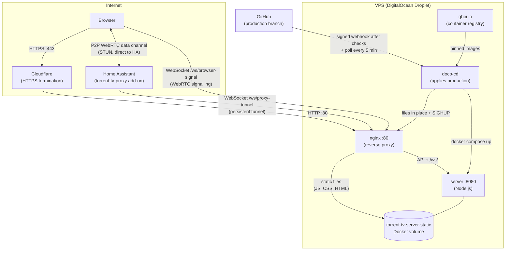

# torrent-tv infra

Docker Compose infrastructure for running the `torrent-tv` server on a VPS: nginx as the reverse proxy and the server, applied on the droplet by [doco-cd](https://github.com/kimdre/doco-cd) from the `production` branch after CI has checked it.

## Stack

| Service | Image | Role |
|---------|-------|------|
| `server` | `ghcr.io/torrent-tv/server:<version>@<digest>` | Node.js app — proxy registry + WebRTC signalling + frontend |
| `nginx` | `nginx:alpine@<digest>` | Reverse proxy on port 80; serves static files directly |
| `doco-cd` | `ghcr.io/kimdre/doco-cd:<version>@<digest>` | Separate compose project (`host/doco-cd/`); applies this repository's `production` branch |

Every image is pinned by tag and digest, so `docker-compose.yml` says exactly what runs. HTTPS termination is handled by **Cloudflare** (orange cloud proxy) — no Let's Encrypt or Certbot needed on the droplet.

## Architecture


```mermaid
graph TB
  subgraph Internet
    Browser["Browser"]
    HA["Home Assistant\n(torrent-tv-proxy add-on)"]
    CF["Cloudflare\n(HTTPS termination)"]
  end

  subgraph VPS["VPS (DigitalOcean Droplet)"]
    direction TB
    NGINX["nginx :80\n(reverse proxy)"]
    SERVER["server :8080\n(Node.js)"]
    DOCO["doco-cd\n(applies production)"]
    VOL[("torrent-tv-server-static\nDocker volume")]
    GHCR["ghcr.io\n(container registry)"]
  end

  Browser -->|"HTTPS :443"| CF
  CF -->|"HTTP :80"| NGINX

  NGINX -->|"static files\n(JS, CSS, HTML)"| VOL
  NGINX -->|"API + /ws/"| SERVER
  SERVER --- VOL

  HA -->|"WebSocket /ws/proxy-tunnel\n(persistent tunnel)"| NGINX
  Browser -->|"WebSocket /ws/browser-signal\n(WebRTC signalling)"| NGINX

  GH["GitHub\n(production branch)"]
  GH -->|"signed webhook after checks\n+ poll every 5 min"| DOCO
  DOCO -->|"docker compose up"| SERVER
  DOCO -->|"files in place + SIGHUP"| NGINX
  GHCR -->|"pinned images"| DOCO

  Browser <-->|"P2P WebRTC data channel\n(STUN, direct to HA)"| HA
```

## Request Flow

```mermaid
sequenceDiagram
  participant B as Browser
  participant CF as Cloudflare
  participant NX as nginx :80
  participant SV as server :8080
  participant HA as HA Proxy add-on

  Note over B,HA: Static assets
  B->>CF: GET /app.js
  CF->>NX: HTTP GET
  NX->>NX: try_files → volume
  NX-->>B: file from volume (nginx, no Node hit)

  Note over B,HA: API request
  B->>CF: GET /api/proxy-clients/health
  CF->>NX: HTTP GET
  NX->>SV: proxy_pass @node
  SV->>HA: health-request via tunnel WS
  HA-->>SV: health-response
  SV-->>B: JSON

  Note over B,HA: WebRTC signalling
  B->>CF: WebSocket /ws/browser-signal
  CF->>NX: Upgrade: websocket
  NX->>SV: proxy_pass /ws/ (upgrade headers set)
  SV-->>B: { type: "session", sessionId }
  B->>SV: SDP offer → forwarded to HA via tunnel
  HA->>SV: SDP answer → forwarded to B via /ws/

  Note over B,HA: P2P streaming (bypasses server entirely)
  B<-->HA: WebRTC data channel
```

## Directory Layout

```
infra/
├── docker-compose.yml           # the production stack: server + nginx + shared volume
├── docker-compose.local.yml     # dev overlay: build server from ../server source
├── .doco-cd.yaml                # how doco-cd applies this repository (production branch)
├── host/doco-cd/                # doco-cd itself, applied by hand
├── host/logs/                   # rsyslog rule and rotation for the log files, installed by hand
├── prod.sh                      # apply by hand when doco-cd is not available
├── scripts/                     # deploy, site and page checks, digest updates
└── nginx/
    ├── webauth.courses.conf     # server block for the production domain
    ├── revision.common          # /_infra/revision: raised with every nginx change
    └── compression.common       # shared gzip settings (included by server blocks)
```

On the droplet this repository is cloned at `/websites/infra` (doco-cd's own
compose file is applied from there); doco-cd keeps its data in
`/websites/doco-cd`.

## Deploy

### How a change reaches the droplet

1. A commit lands on `main` — by a person, or by a server release that writes the
   new server version and digest into `docker-compose.yml`.
2. CI checks it: commit headers, every image pinned by digest, `docker compose
   config`, `nginx -t` in the pinned nginx image, and that a change under
   `nginx/` raised the revision in `nginx/revision.common`.
3. The serial `deploy` job (one at a time, queued) moves `production` to the
   commit without force — a commit `production` already contains is skipped as
   superseded — and sends doco-cd a signed webhook for that commit through
   `https://webauth.courses/_deploy/`. doco-cd deploys the commit the webhook
   names; its poll every five minutes deploys the head of `production`.
4. CI follows the deployment run until doco-cd reports it, then checks the site
   from outside: static files, `/env.js` reports the pinned server version,
   `/_infra/revision` equals the committed revision (nginx accepted the new
   configuration on SIGHUP), the signalling WebSocket opens, every proxy connected
   before is back; and a headless browser checks the page lists proxies and shows
   the file picker. No torrent is involved.

A configuration change reloads nginx without recreating it: doco-cd updates the
mounted files and sends SIGHUP. nginx checks the new configuration itself and
keeps serving the old one if it is invalid. doco-cd still reports such a
deployment as succeeded, so the revision check is what catches it: CI sees the old
revision and fails.

The `deploy` job is off until the `production` environment has `DEPLOY_URL`
(variable) and `DEPLOY_WEBHOOK_SECRET`, `DEPLOY_API_SECRET` (secrets).

### First time on a host (torrent-tv/meta#93, stage 8.5)

1. Snapshot what runs: `git -C /websites/infra rev-parse HEAD`, and an override
   with the digest of every running image, e.g.
   `/websites/rollback/<date>/images.yml` with `image: <repository>@<digest>`.
2. Create `production` on a commit of `main` whose checks passed.
3. Put the doco-cd secrets on the host (`/websites/doco-cd/secrets/webhook_secret`,
   `api_secret`, mode 400) and start it:
   `docker compose -p doco-cd -f /websites/infra/host/doco-cd/docker-compose.yml up -d`.
   On start it applies `production` at once (and removes watchtower, an orphan of
   the `infra` project now). A second run, if needed, goes through loopback:
   `curl -fsS -X POST -H "x-api-key: …" "http://127.0.0.1:8090/v1/api/poll/run?wait=true"`.
   Install the log files' rule and rotation first (see [Logs](#logs)), so the
   first lines of every container already land in their files.
4. Run the main workflow by hand to check the site, then set `DEPLOY_URL` and the
   two secrets in the `production` environment.

Rollback of that first switch:

```bash
docker compose -p doco-cd down
cd /websites/infra && git checkout <snapshot revision>
docker compose -p infra -f docker-compose.yml -f docker-compose.prod.yml -f /websites/rollback/<date>/images.yml up -d --remove-orphans --pull never
```

### By hand, when doco-cd is not available

```bash
cd /websites/infra && git checkout production && git pull && ./prod.sh
```

## Logs

Every container of this host — `server`, `nginx` and `doco-cd` — logs through
Docker's `journald` driver with a tag naming its source. The lines therefore live
in the host journal, not in the container, and outlive the container that every
deployment recreates. Before torrent-tv/meta#96 they used the `json-file` driver
and were deleted with the container on each deployment.

journald forwards each line to rsyslog, and the rule in
[`host/logs/30-torrent-tv.conf`](host/logs/30-torrent-tv.conf) writes it to a
plain-text file named by its source:

| File | Source | Journal tag |
|------|--------|-------------|
| `/var/log/torrent-tv/server.log` | the server's own output | `torrent-tv-server` |
| `/var/log/torrent-tv/client.log` | browser lines forwarded to `POST /api/client-logs` | `torrent-tv-server`, line begins with `[client ` |
| `/var/log/torrent-tv/nginx.log` | nginx access and error log | `torrent-tv-nginx` |
| `/var/log/torrent-tv/doco-cd.log` | doco-cd's deployments | `torrent-tv-doco-cd` |

Each line begins with the host's time (RFC 3339, microseconds, UTC) and the tag.
A browser line also carries the browser's own time and the session ids: `[client
<device> <sessionId> sig=<signalSessionId>] <HH:MM:SS.mmm> <level>: …`. The `sig`
id is the one the proxy prints as `[webrtc] Session <id>`. The browser writes to
the droplet only until it has a data channel and when the page unloads; the rest
of a viewing is on the proxy (`proxy/docs/logs.md`).

Reading:

```bash
ssh do 'tail -n 500 /var/log/torrent-tv/client.log'
ssh do 'grep sig=<signalSessionId> /var/log/torrent-tv/client.log'
ssh do 'zgrep -h <text> /var/log/torrent-tv/server.log*'   # rotated turns too; not in time order
ssh do 'journalctl -t torrent-tv-server --since "2026-10-05 09:00" --until "2026-10-05 10:00" -o short-iso-precise'
```

`docker logs infra-server-1` shows only the lines of the CURRENT container: with
the `journald` driver Docker reads the journal by container id, and a deployment
gives the server a new one. Use the files or `journalctl -t` for anything older.

Retention: the files rotate daily, and earlier once a file passes 100 MB when
logrotate next runs; fourteen turns are kept, compressed
([`host/logs/torrent-tv.logrotate`](host/logs/torrent-tv.logrotate)). The journal
is bounded by journald's own limit, 10 % of the file system. Both figures are a
choice of how much to keep, not a measurement.

Control at start: `TTV_LOG_DRIVER` picks the Docker logging driver for every
service (default `journald`; `docker-compose.local.yml` defaults it to
`json-file`, since Docker Desktop has no journald). The tag is fixed per service,
because the file it lands in is chosen by it.

Installing the rule and the rotation on a host (by hand: CI has no login to the
host):

```bash
install -m 644 /websites/infra/host/logs/30-torrent-tv.conf /etc/rsyslog.d/30-torrent-tv.conf
install -m 644 /websites/infra/host/logs/torrent-tv.logrotate /etc/logrotate.d/torrent-tv
install -d -o syslog -g adm -m 0755 /var/log/torrent-tv
rsyslogd -N1 && systemctl restart rsyslog
```

`rsyslogd -N1` checks the whole configuration first: an invalid rule leaves
rsyslog writing nothing at all until it is fixed.

## Local Development

Build the server image from source instead of pulling from GHCR:

```bash
cd infra
docker compose -f docker-compose.yml -f docker-compose.local.yml up --build
```

nginx is available at `http://localhost:80`. The `docker-compose.local.yml` overlay overrides the server's `image:` with a `build: context: ../server` so docker compose builds from your local changes.

## nginx Configuration

### Static files via Docker volume

The `server` container populates the `torrent-tv-server-static` volume with compiled frontend assets. nginx mounts the same volume read-only and serves files from it directly — the Node.js process is never hit for static assets.

```
Browser → nginx → Docker volume → response   (fast, no Node.js hop)
Browser → nginx → Node.js       → response   (fallback for /api, /health, /ws)
```

### WebSocket proxying

The `/ws/` location block sets the correct upgrade headers (`Upgrade`, `Connection`) and uses a 3600 s `proxy_read_timeout` so long-lived WebSocket connections — the proxy tunnel and browser signalling — don't get killed by nginx's idle timeout.

```nginx
location /ws/ {
    proxy_pass $upstream;
    proxy_http_version 1.1;
    proxy_set_header Upgrade $http_upgrade;
    proxy_set_header Connection "upgrade";
    proxy_read_timeout 3600s;
}
```

### Dynamic upstream resolution

nginx uses `resolver 127.0.0.11` (Docker's internal DNS) with `valid=10s` so it re-resolves the `server` hostname after a deployment recreates the container. Without this, nginx caches the old IP and returns 502 until it's reloaded.

```nginx
resolver 127.0.0.11 valid=10s;
set $upstream http://server:8080;
```

### Adding a new service

1. Add the service to `docker-compose.yml`.
2. Create `nginx/<your-domain>.conf` — copy `webauth.courses.conf` as a template and change `server_name`, `root`, and `set $upstream`.
3. Add a DNS A record in Cloudflare pointing to the droplet IP with the orange cloud enabled (proxy mode).
4. Raise the number in `nginx/revision.common` in the same commit; CI refuses the commit otherwise, and the deployment reloads nginx.

## CI / CD

| Step | Where | Trigger |
|------|-------|---------|
| Build and push the server image | GitHub Actions (`server` repo) | a release on `main` |
| Write the server version and digest here | the server release, with the `torrent-tv-release` app | the same release |
| Check, move `production`, apply, verify | GitHub Actions (this repo) + doco-cd | push to `main` |
| Update pinned digests | GitHub Actions (this repo, daily) | schedule |

## Volumes

| Volume | Used by | Purpose |
|--------|---------|---------|
| `infra_torrent-tv-server-static` | `server` (rw), `nginx` (ro) | Frontend static files; avoids serving them through Node.js |

## Environment Variables

| Variable | Default | Set in |
|----------|---------|--------|
| `PORT` | `8080` | `docker-compose.yml` |
| `NODE_ENV` | `production` | Server `Dockerfile` |
| `TMDB_READ_TOKEN_FILE` | `/run/secrets/torrent-tv/tmdb_read_token` | `docker-compose.yml` |
| `TTV_LOG_DRIVER` | `journald` (`json-file` with `docker-compose.local.yml`) | the shell or `.env` at `docker compose up`; see [Logs](#logs) |

## Server cache and subtitle providers

The `torrent-tv-server-cache` volume holds the server's independent cache of
catalogue records, subtitle search results and selected subtitle files. It is
not shared with proxy torrent storage. `SERVER_CACHE_MIB` limits the database
to 1024 MiB initially; entries are evicted by last access across all namespaces.
The server reserves 256 MiB of free disk space before a cache write. The volume
survives image replacement and is owned by the image's `app` user.

Provider credentials follow the existing file-secret convention:

1. `/websites/infra/secrets/opensubtitles_api_key`, exposed only through
   `OPENSUBTITLES_API_KEY_FILE`.
2. `/websites/infra/secrets/jimaku_api_key`, exposed only through
   `JIMAKU_API_KEY_FILE`.

Both files need uid 100 ownership and mode 400, like the TMDB token. Missing keys
disable their provider without preventing server startup. GitHub repository
secrets `OPENSUBTITLES_API_KEY` and `JIMAKU_API_KEY` are stored separately;
CI never places them in an image and has no SSH access to the host. Rotate the
host files and restart the server when rotating a provider key.

## Secrets

Secrets are files in `secrets/` next to `docker-compose.yml`, placed on the
droplet by hand. The directory is in this repository (holding only
`.gitkeep`); everything else in it is ignored by git, so a secret can never be
committed.

`docker-compose.yml` mounts `/websites/infra/secrets` (an absolute path: doco-cd
deploys from its own copy of the repository) read-only into the server container at
`/run/secrets/torrent-tv`, and passes the PATH of each file in an environment
variable — never the value. The value is therefore not in the image, not in
the container's environment and not in `docker inspect`. Because the directory
always exists, the container starts without any secret in it; the feature that
needs it is then off and says so in the log.

| File | Used for | Read by |
|------|----------|---------|
| `secrets/tmdb_read_token` | TMDB API Read Access Token (film titles, episode names, images) | server, once at startup; logs `TMDB token loaded` or why not |

The server runs as the image's `app` user, uid 100 in the current image
(`docker exec infra-server-1 id`). A secret must be readable by it: owner
uid 100, mode `400`. Put the token there without it
reaching the shell history or the screen:

```bash
ssh -t do 'umask 077 && read -rsp "TMDB token: " T && printf "%s" "$T" > /websites/infra/secrets/tmdb_read_token && chown 100:101 /websites/infra/secrets/tmdb_read_token && chmod 400 /websites/infra/secrets/tmdb_read_token && echo && ls -ln /websites/infra/secrets'
```

Then recreate the server container so it reads the file:
`docker compose -p infra -f /websites/infra/docker-compose.yml up -d --force-recreate server`.

## Troubleshooting

**A deployment failed in CI**
The `deploy` job prints doco-cd's verdict and every check that did not pass.
doco-cd's own log: `/var/log/torrent-tv/doco-cd.log` (see [Logs](#logs)).

**WebSocket connections drop after 100 s behind Cloudflare**
Cloudflare's free plan has a 100 s WebSocket idle timeout. The proxy tunnel and browser signalling WebSocket reconnect by themselves.
